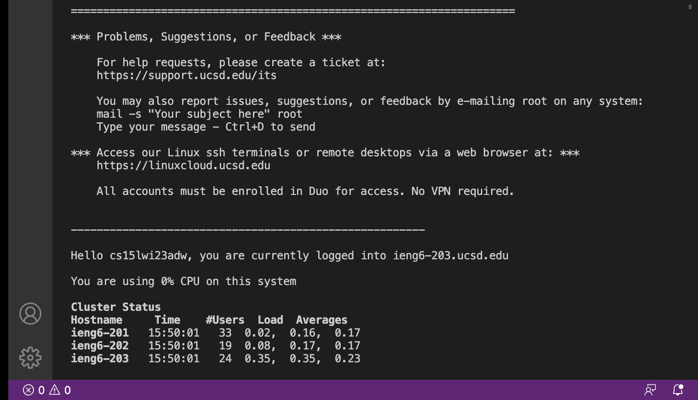

**Installing VScode**

1) Go to the Visual Studio Code website https://code.visualstudio.com/
2) Follow the instructions that the website gives you. There will be a different set of instructions based on which operating system you have. 
3) Once it is installed you will be able to open a window that looks similar to this:

4)Your window may look a little different based on your Operating System and settings.

**Remotely Connecting**

1)Open a terminal in VScode and type in this command (replace the username with your course-specific account): $ ssh cs15lwi23zz@ieng6.ucsd.edu
2)You may get a message saying the authenticity of the host cant be established, and it will ask you if you are sure you want to continue connecting. Answer yes to this question and then give your password
3) Your terminal should now be connected to one of the CSE basement computers and you should have a screen like this:

**Trying Some Commands**

1)Now that you have established the remote connection, try using some commands. 
2)Running these commands in the terminal should look something like this:

3) Some specific commands to try are:
- cd
- cd ~
- ls -lat
- ls -a
- ls <directory>
  
  
